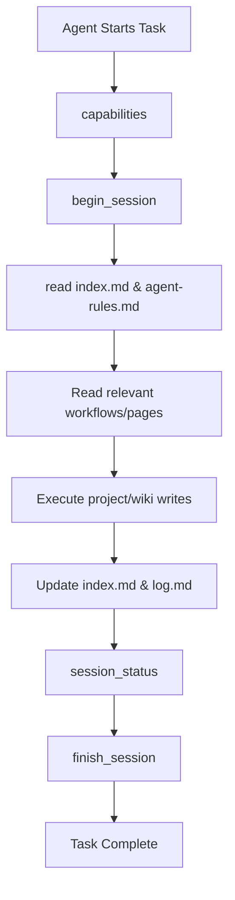

# Scrinium

Scrinium is an Apache 2.0 open-source Model Context Protocol (MCP) server written in Go that manages a local project wiki (`llm-wiki`) for AI coding agents. It serves as a governed, persistent memory layer that keeps agents aligned, reduces hallucinations, and prevents rule-drift.

> [!NOTE]
> **The Agent Memory Paradigm**
> Scrinium realizes Andrej Karpathy's vision of text-based persistent memory (scratchpads) for AI agents (as described in his [original gist](https://gist.github.com/karpathy/442a6bf555914893e9891c11519de94f)). By utilizing a local directory of structured markdown files, agents can read project rules, query historical context, and record architecture decisions directly within the repository.

---

## Key Features

*   **Policy-Based Access Control (PBAC)**: Protects foundational rules and architectural records from direct agent overwrites.
*   **Enforced Session Loop**: Compels agents to read context (`index.md` and `agent-rules.md`) before making writes, and validates that logs and indexes are updated before the session completes.
*   **Adoption & Linting Tools**: Provides read-only health checks to scan for contradictions, stale claims, missing indices, and prompt-injection vectors.
*   **Agent Enforcement CLI**: Automatically creates or refreshes Scrinium-managed instructions inside `AGENTS.md` and `CLAUDE.md`.
*   **Standard Library Only**: Compiles into a single standalone binary with zero runtime dependencies.

---

## How It Works: The Enforced Session Loop

Scrinium guides agent workflows using a deterministic state machine enforced through MCP session tools:



---

## Getting Started

### 1. Install

**Via Homebrew (recommended):**

```bash
brew tap ozgurcd/tap
brew install --cask scrinium
```

**Build from source:**

```bash
# Compile to local binary
make build

# Install to /usr/local/bin
sudo make install

# Print compiled version
scrinium version
```

### 2. Configuration (`scrinium.json`)

Configure Scrinium in your repository root. Specify your wiki directory and which files are protected under write governance:

```json
{
  "wiki_root": "./llm-wiki",
  "write_governance": {
    "protected_files": [
      "rules.md",
      "architecture/*",
      "core-decisions/*"
    ]
  }
}
```
*Note: On its first run, Scrinium automatically creates the configured `wiki_root` and bootstraps `scrinium-guide.md` to help agents onboard.*

### 3. Generate Agent Instructions

Enforce Scrinium usage by generating the repository's instruction blocks:

```bash
scrinium enforce-agents
```
This updates Scrinium-managed blocks in `AGENTS.md` and `CLAUDE.md`, directing agents to start Scrinium, read the required rules, and finish their sessions before reporting completion.

### 4. Document Ingestion Prompt

Copy and paste the following prompt to your coding agent to ingest raw documents (placed under `raw/inbox/`) into the wiki:

```text
Please ingest the raw document located at raw/inbox/<YOUR_FILE_NAME> into our project wiki. 

To do this, use the Scrinium MCP server and follow these steps:
1. Call `capabilities` to start.
2. Run `begin_session` to initialize your workspace session.
3. Read 'llm-wiki/workflows/ingest.md' to follow the ingestion safety guidelines and process.
4. Call `register_source` to assign a unique ID (in the format SRC-YYYYMMDD-slug) and add the source to the registry.
5. Create a structured summary at `llm-wiki/sources/<source-id>.md`.
6. Update any affected topic/project pages with findings or claims (referencing the source ID for provenance).
7. Update the registry index at `llm-wiki/source-registry.md` and page list at `llm-wiki/index.md`.
8. Append a parseable entry to `llm-wiki/log.md` using the Source Ingest Template from `llm-wiki/prompt-templates.md`.
9. Verify your workspace and call `finish_session` before reporting completion.
```

---

## MCP Tools Reference

Scrinium exposes the following tools to connected MCP clients:

| Tool Name | Type | Description |
| :--- | :--- | :--- |
| `capabilities` | Read-only | Returns Scrinium's active governance rules, tools list, and instructions. Call this first to orient the agent. |
| `setup_llm_wiki` | Write | Bootstraps the standard `llm-wiki` folder structure and template pages. Leaves existing files unchanged. |
| `begin_session` | Write | Starts a tracked work session. Wiki writes are blocked until a session is activated. |
| `session_status` | Read-only | Returns pages read, pages written, and pending maintenance requirements. |
| `finish_session` | Write | Marks the session inactive. Fails if required log, index, or registry updates are missing. |
| `read_wiki_page` | Read-only | Reads the contents of any wiki page. |
| `update_wiki_page` | Write | Overwrites a wiki page. Rejects writes targeting protected foundational documents with instructions on how to propose drafts. |
| `create_page` | Write | Creates a new wiki page only if it does not already exist. |
| `move_page` | Write | Renames or moves a wiki page. Rejects if destination exists or paths are protected. |
| `archive_page` | Write | Moves obsolete pages under `archive/` instead of deleting them. |
| `create_draft` | Write | Proposes changes to protected files by writing to the `drafts/` directory. |
| `append_log` | Write | Appends content to a log file. Bypasses governance for directory-pattern protections (e.g. `core-decisions/*`) but blocks directly protected files (e.g. `rules.md`). |
| `lint_llm_wiki` | Read-only | Checks wiki health: missing standard pages, index gaps, log gaps, provenance gaps, and prompt-injection risks. |
| `adopt_llm_wiki` | Read-only | Scans manual or non-Scrinium wikis and provides recommendations for onboarding. |
| `register_source` | Write | Registers raw sources in `source-registry.md` and creates summary stubs. |

---

## Development & Verification

To run tests and perform code quality verification, use the Makefile:

```bash
# Run unit tests
make test

# Run full verify pipeline (format, vet, staticcheck, govulncheck)
make verify
```

